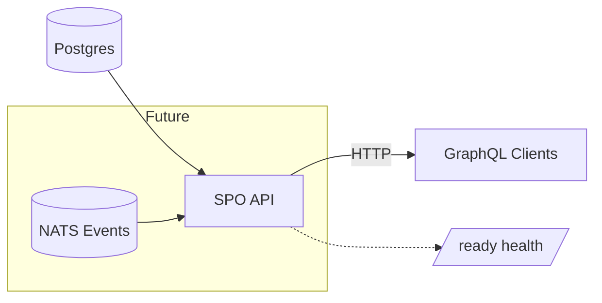

# SPO API Architecture

This document describes the architecture of the `spo-api` service: its purpose, components, data / request flow, dependencies, operational concerns, and planned evolution. It mirrors the structure used by `indexer-api`, adapted for a Stake Pool Operator (SPO) focused read-only API MVP.

## Purpose & Scope

Expose Stake Pool Operator (SPO) and per-epoch performance / identity data to Midnight Explorer (and other clients) over GraphQL (HTTP + WebSocket). For the current MVP:

- Read-only queries backed by the existing Postgres database used by the indexer.
- No NATS dependency yet (live updates & catch-up tracking to be added later).
- Simple readiness: DB connectivity + (placeholder) caught-up flag (always `true` for now).

Future iterations will introduce:

- NATS subscription to indexer events for real caught-up gating and push updates.
- Subscriptions for live SPO / epoch performance changes.
- Repository layer with richer projections / aggregations.

## High-level Data / Control Flow

```text
+----------------+         +----------------------+        +----------------------+        +------------------+
| Postgres (SQL) |  SQL    |  spo-api Application |  HTTP  |  Clients (GraphQL/WS) | Admin | /ready endpoint  |
+----------------+ <------ +----------------------+ <----->+  Queries / Future WS  | check |  DB + caught_up   |
                               |   Axum + async-graphql    +----------------------+        +------------------+
                               |   (v1 schema)             
                               |   State: { caught_up, db }
                               +---------------------------+
```

Mermaid (future NATS integration indicated but not active yet):



## Components & Responsibilities

- Application (`src/application.rs`)
  - Loads network settings, spawns API server.
  - Maintains `caught_up: AtomicBool` (placeholder `true` until NATS integration).
  - Handles SIGTERM for graceful shutdown.

- Infra API (`src/infra/api/*`)
  - `AxumApi`: builds the router and runs the server.
  - `AppState`: composite state (caught_up + optional Db pool) with `FromRef` splits for Axum extractors.
  - `/ready`: returns `503` if (future) not caught up or DB ping fails; else `200`.
  - GraphQL v1 schema mounted at `/api/v1/graphql` (and future WS at `/api/v1/graphql/ws`).
  - Middleware: tracing (`FastraceLayer`), CORS (permissive), request body size limiting + custom 400->413 remap.

- Domain (`src/domain.rs` and future domain modules)
  - Defines the `Api` trait consumed by application orchestration.
  - Will host SPO-specific domain models (stake pool operator identity, performance snapshots, epoch aggregates).

- Repository Layer (planned: `src/infra/repo.rs`)
  - SQL query abstraction over Postgres using `sqlx`.
  - Provide typed return models consumed by GraphQL resolvers.
  - Encapsulate pagination, filtering, and performance queries.

## Readiness & Health

Current readiness logic:

1. `caught_up` flag (always `true` in MVP).
2. Lightweight DB health ping `SELECT 1` inside `/ready`.


If either fails (in the future, actual catch-up check), returns `503 Service Unavailable`.

## GraphQL Schema (v1 MVP)

- `Query.serviceInfo`: returns service name, version, network.
- Future additions:
  - `stakePoolOperators(limit, offset, filters)`
  - `stakePoolOperator(id)`
  - `epochPerformance(epochNumber)`
  - Aggregations (top K by performance, delegation composition, historical trend)
- Subscriptions (deferred until NATS): live operator performance updates, epoch rollovers.

## Data Model (Planned)

Conceptual entities (not yet implemented):

- StakePoolOperator { id, identityKey, displayName, createdAt, lastActiveAt, performanceScore, commissions, totalStake }
- EpochPerformance { epoch, operatorId, blocksProduced, blocksExpected, performanceRatio, stakeShare }
- DelegatorStake (optional for explorer pivot views)

Indexes / queries to optimize:

- By operator id
- By epoch + operator id
- Top N operators by performance for a given epoch

## Error Handling

- `/ready` returns targeted messages: "database not ready" vs. future "indexer not caught up".
- GraphQL resolvers (when added) will map domain errors into structured GraphQL errors with categories (e.g. NOT_FOUND, INTERNAL).

## Telemetry & Metrics

(Planned)

- Request tracing via existing fastrace integration.
- Gauge for connected WS clients (already scaffolded; currently unused field in `Metrics`).
- Counters for query types and DB latency histograms (to be added alongside repo layer).

## Configuration

`config.yaml` (MVP subset):

- `infra.api`: address, port, body limits, complexity, depth.
- `infra.storage`: Postgres connection pool config.
- `application.network_id`: network enumeration.
- Telemetry config (tracing + metrics) reused from `indexer-common`.

## Build & Run

```sh
# Build
cargo build -p spo-api --features cloud

# Run (ensure Postgres env / config is valid)
cargo run -p spo-api --features cloud

# Health
curl -i http://localhost:<port>/ready
```

## Evolution Roadmap

| Milestone | Description | Status |
|-----------|-------------|--------|
| MVP scaffold | Service, config, basic GraphQL, readiness, DB pool | DONE |
| Repo layer | Introduce `repo` module with first SPO queries | PENDING |
| SPO domain models | Define core structs + mapping | PENDING |
| GraphQL SPO queries | `stakePoolOperators`, `stakePoolOperator` | PENDING |
| Performance endpoints | Epoch performance aggregates | PENDING |
| NATS integration | Real catch-up + subscriptions | PENDING |
| Subscriptions | Live operator performance stream | PENDING |
| Metrics expansion | DB/query metrics, WS client gauge | PENDING |
| Hardening | Auth (if required), pagination policies, limits | FUTURE |

## Design Principles

- Start minimal: add complexity (NATS, subscriptions) only when data feed is ready.
- Keep GraphQL boundary stable; evolve underlying queries behind repository abstraction.
- Prefer explicit typed models over ad-hoc JSON for performance data.
- Systematically enforce limits (complexity, depth, pagination) for resilience.

## Open Questions / Future Decisions

- Exact schema for performance scoring (source of truth & calculation timing).
- Need for caching layer (in-memory epoch aggregates) vs. pure SQL queries.
- Security / auth requirements for future administrative fields (if any).

## Status Summary (Current)

- Server & routing: READY
- Readiness endpoint: READY (DB ping + placeholder caught_up)
- DB pool: READY
- GraphQL base schema: READY (serviceInfo)
- Repo layer: NOT IMPLEMENTED
- SPO domain models: NOT IMPLEMENTED
- Subscriptions: NOT IMPLEMENTED
- Metrics enrichment: NOT IMPLEMENTED
- NATS integration: NOT IMPLEMENTED

---
Last updated: 2025-09-18
